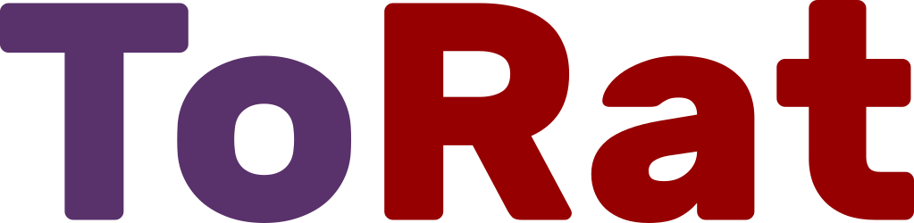

# 

A Cross Platform Remote Administration tool written in Go using Tor as its transport mechanism
currently supporting Windows, Linux, MacOS clients.

## DISCLAIMER
USE FOR EDUCATIONAL PURPOSES ONLY

## Preview

## Wiki
[How to use ToRat Docker Image](https://github.com/lu4p/ToRat/wiki/How-to-use-the-ToRat-Docker-Image)

### Client Commands

  Command     | Status      |   Info
  ---         | ---         |   ---
  **cd**          | Working     |   change the working directory of the client
  **ls**          | Working     |   list the content of the working directory of the client
  **shred**       | Working     |   delete files/ directories unrecoverable
  **screen**      | Working     |   take a Screenshot of the client
  **cat**         | Working     |   view Textfiles from the client including .docx, .rtf, .pdf, .odt
  **alias**       | Working     |   give the client a custom alias
  **down**        | Working     |   download a file from the client
  **up**          | Working     |   upload a file to the client
  **speedtest**   | Working     |   speedtest a client's internet connection
  **hardware**    | Working     |   collects a varity of hardware specs from the client
  **escape**      | Working     |   escape a command and run it in a native shell on the client
  **reconnect**   | Not Working |   tell the client to reconnect
  **help**        | Working     |   lists possible commands with usage info
  **exit**        | Working     |   background current session and return to main shell

### Server Commands 

  Command | Status      |   Info
  ---     |  ---        |   ---
  **select**  | Working     | select client to interact with
  **list**    | Working     | list all connected clients
  **alias**   | Working     | select client to give an alias
  **cd**      | Working     | change the working directory of the server
  **help**    | Working     | lists possible commands with usage info
  **exit**    | Working     | exit the server

## Current Features
### Architecture
- RPC (Remote procedure Call) based communication for easy addition of new functionallity
- Automatic upx leads to client binaries of ~6MB with embedded Tor
- sqlite via gorm for storing information about the clients
- client is obfuscated via [garble](https://github.com/burrowers/garble)

## Server Shell
- Cross Platform reverse shell (Windows, Linux, Mac OS)
- Supports multiple connections
- Welcome Banner
- Colored Output
- Tab-Completion of:
  - Commands
  - Files/ Directories in the working directory of the server

- Unique persistent ID for every client
	- give a client an Alias
	- all Downloads from client get saved to ./$ID/$filename

## Persistence
- Windows:
	- [ ] Multiple User Account Control Bypasses (Privilege escalation)
	- [ ] Multiple Persistence methods (User, Admin)

- Linux:
  - [ ] Multiple Persistence methods (User, Admin)

## Tor
- Fully embedded Tor within go

- the ToRAT_client communicates over TLS encrypted RPC proxied through Tor with the ToRat_server (hidden service)
	- [x] anonymity of client and server
	- [x] end-to-end encryption

- optional transport without Tor e.g. Use Tor2Web, a DNS Hostname or public/ local IP
	- [x] smaller binary ~3MB upx'ed
	- [ ] anonymity of client and server

## Upcoming Features
- [ ] Bulk Commands
- [ ] Persistence and privilege escalation for Linux
- [ ] Persistence and privilege escalation for Mac OS
- [ ] Support for Android and iOS (needs fix of https://github.com/ipsn/go-libtor/issues/12)
- [ ] [File-less Persistence on Windows](https://github.com/ewhitehats/InvisiblePersistence)

## Contribution
All contributions are welcome you don't need to be an expert in Go to contribute.

## Credits
- [Tor](https://www.torproject.org/)
- [Tor controller libary](https://github.com/cretz/bine)
- [Python Uacbypass and Persistence Techniques](https://github.com/rootm0s/WinPwnage)
- [Modern Cli](https://github.com/abiosoft/ishell)
- [Colored Prints](https://github.com/fatih/color)
- [Screenshot libary](https://github.com/vova616/screenshot)
- [TLS Certificate generator](https://github.com/lu4p/genCert)
- [Shred library](https://github.com/lu4p/genCert)
- [Extract Text from Documents](https://github.com/lu4p/cat)
- [RPC](https://golang.org/pkg/net/rpc/)
- [UPX](https://upx.github.io/)
- [gorm](https://github.com/go-gorm/gorm)
- [Obfuscation](https://github.com/burrowers/garble)
